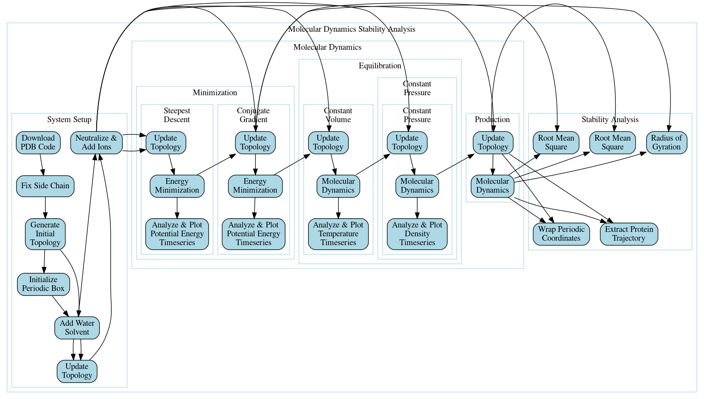
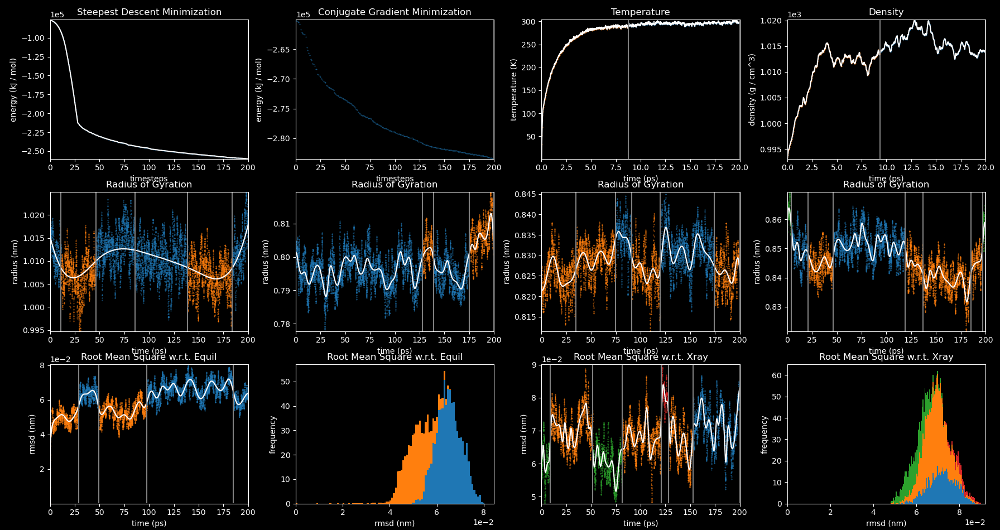
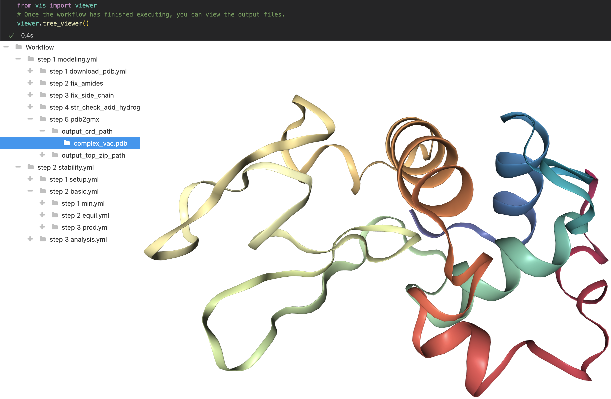

# Workflow Inference Compiler

Scientific computing can be difficult in practice due to various complex software issues. In particular, chaining together software packages into a computational pipeline can be very error prone. Using the [Common Workflow Language](https://www.commonwl.org) (CWL) greatly helps, but users still need to explicitly specify how to connect the steps. The Workflow Inference Compiler allows users to specify computational protocols at a very high level of abstraction, it automatically infers almost all connections between steps, and it compiles to CWL for execution. The examples are chosen from classical molecular dynamics but like CWL, the software is general purpose and is not limited to any specific domain.

## Quick Start
See the [installation guide](docs/installguide.md) for more details, but:
```
git clone --recursive https://github.com/jfennick/workflow_inference_compiler.git
cd workflow_inference_compiler
conda create --name wic
conda activate wic
./conda_devtools.sh
pip install .
wic --yaml examples/gromacs/tutorial.yml --run_local True --quiet True
```
That last command will infer edges, compile the yml to CWL, generate a GraphViz diagram of the workflow, and run it locally.



Then, in another terminal, use the following command to view the plots in real-time.
```
conda activate wic
timeseries_plots
```



You can also view the 3D structures in the Jupyter notebook `src/vis/viewer.ipynb`.



The Workflow Inference Compiler is a [Domain Specific Language](https://en.wikipedia.org/wiki/Domain-specific_language) (DSL) based on the [Common Workflow Language](https://www.commonwl.org). CWL is fantastic, but explicitly constructing the Directed Acyclic Graph (DAG) associated with a non-trivial workflow is not so simple. For example, the workflow shown above is based on the following [gromacs tutorial](https://mmb.irbbarcelona.org/biobb/availability/tutorials/cwl). Instead of writing raw CWL, you can write your workflows in a much simpler yml DSL. For technical reasons edge inference is far from unique, so ***`users should always check that edge inference actually produces the intended DAG`***.

## Edge Inference

The key feature is that in most cases, you do not need to specify any of the edges! They will be automatically inferred for you based on types, file formats, and naming conventions. For more information, see the [user guide](docs/userguide.md#edge-inference-algorithm) If for some reason edge inference fails, there is a syntax for creating [explicit edges](docs/userguide.md#explicit-edges).

## Subworkflows

Subworkflows are very useful for creating reusable, composable building blocks. As shown above, recursive subworkflows are fully supported, and the edge inference algorithm has been very carefully constructed to work across subworkflow boundaries. If there are subworkflows, the linear order in the parent workflow is determined by inlineing the subworkflows. (If you are unsure, simply enable `--cwl_inline_subworkflows`) Note that since CWL files for subworkflows are also automatically generated, any subworkflow can be treated as a black box if desired.

### Embedding Independence
Moreover, in addition to ignoring irrelevant details inside a subworkflow, users should also be able to ignore the details of the parent workflow in which a subworkflow is embedded. In other words, subworkflows should be context-free and have 'embedding independence'. Again, the edge inference algorithm has been carefully constructed such that the edges inferred within a subworkflow do not depend on its embedding within a parent workflow. (This requirement is guaranteed by the regression tests!)

## Explicit CWL

Since the yml DSL files are automatically compiled to CWL, users should not have to know any CWL. However, the yml DSL is secretly CWL that is simply missing almost all of the tags! In other words, the compiler merely adds missing information to the files, and so if you know CWL you are free to explicitly add the information yourself. Thus, the yml DSL is intentionally a [leaky abstraction](https://en.wikipedia.org/wiki/Leaky_abstraction).