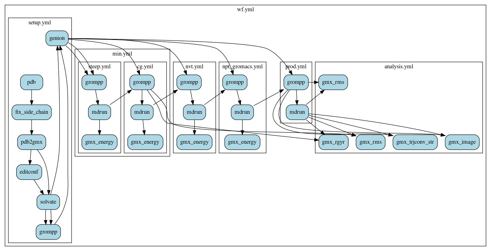

# Workflow Inference Compiler

## Quick Start
```
cd examples/gromacs
python ../../wic.py --yaml wf.yml --cwl_dir ../.. --cwl_output_intermediate_files True --cwl_run_local True
```



The Workflow Inference Compiler is based on the [Common Workflow Language](https://www.commonwl.org). CWL is fantastic, but explicitly constructing the Directed Acyclic Graph associated with a non-trivial workflow is not so simple. For example, the workflow shown above is based on the following [gromacs tutorial](http://mmb.irbbarcelona.org/webdev/slim/biobb/public/availability/tutorials/cwl). Instead of writing raw cwl, you can write your workflows in a much simpler yml format.

## Edge Inference

The key feature is that in most cases, you do not need to specify any of the edges! They will be automatically inferred for you based on file formats and other information. The above command will infer edges, compile the yml to cwl, generate a GraphViz diagram of the workflow, and run it locally.