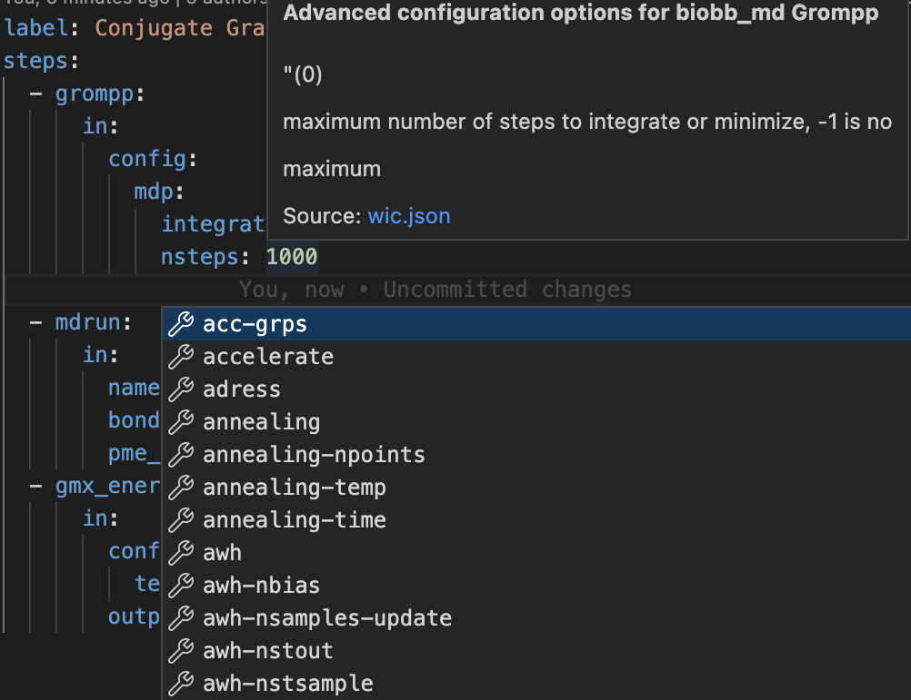

# Install Guide

For pip users:

`pip install wic` # Please read the next sentence

Unlike conda, **pip cannot install the binary system dependencies needed to actually run most workflows!**

If you want to actually run workflows, you (or your sysadmin) will have to manually install and configure additional software!

For conda users / developers:

See the [installation guide for developers](dev/installguide.md)

## vscode

You can use any text editor to modify the YAML files, but we *highly* recommend [Visual Studio Code](https://code.visualstudio.com). vscode is an extremely popular development environment written by Microsoft, but it is open source. It has a large number of extensions for pretty much everything. Most importantly, vscode provides [IntelliSense](https://code.visualstudio.com/docs/editor/intellisense) code completion. We now support this for our custom YAML file format. Just simultaneously press ctrl-space (the control key and the spacebar) and a list of possible values will be shown specific to each yaml tag (along with in-line documentation via tooltips). We also support completion for gromacs mdp files!



To enable this feature, simply install the YAML vscode extension (by Red Hat). Then add the following line to your `.vscode/settings.json` file (or simply use our settings.json file), and run the following command.

```json
"yaml.schemas": {"autogenerated/schemas/wic.json": "*.wic"},
```

```
wic --generate_schemas
```

(You should also run this command anytime you change the input/output API. If you are getting validation errors, try re-running this command!)

After a ~10 second delay, vscode should display "Validating against the Workflow Interence Compiler schema" just above the first line in a \*.wic file.

We also *highly* recommend you add the following line to settings.json, which "Controls whether completions should be computed based on words in the document."

```json
"[yaml]": {
    "editor.suggest.showWords": false
},
```

Using the default value of true, IntelliSense will additionally suggest any text whatsoever that you have previously entered in the current wic file (or other wic files). Of course, even if you select a bad suggestion, IntelliSense will immediately validate it against the schema and prominently highlight any invalid text with a red underline. Moreover, the very first thing the compiler does is use a separate validation implementation to check for errors in the wic files. But in this case it's better to simply disable that particular vscode feature.

### known issues

* Strings which are part of enumerated types (e.g. certain gromacs mdp options) are case-sensitive. Unfortunately, there does not seem to be a simple way to allow case-insensitive strings in the schema. This should not be a problem at runtime (we can ignore case in the compiler), but vscode will complain that 'Value must be ...'

### vscode extensions

When you open the project folder, VSCode should prompt you to install the following list of recommended extensions.

These vscode extensions are strongly recommended for users:

* YAML (Red Hat)
