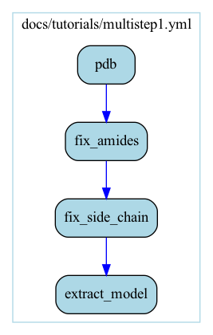
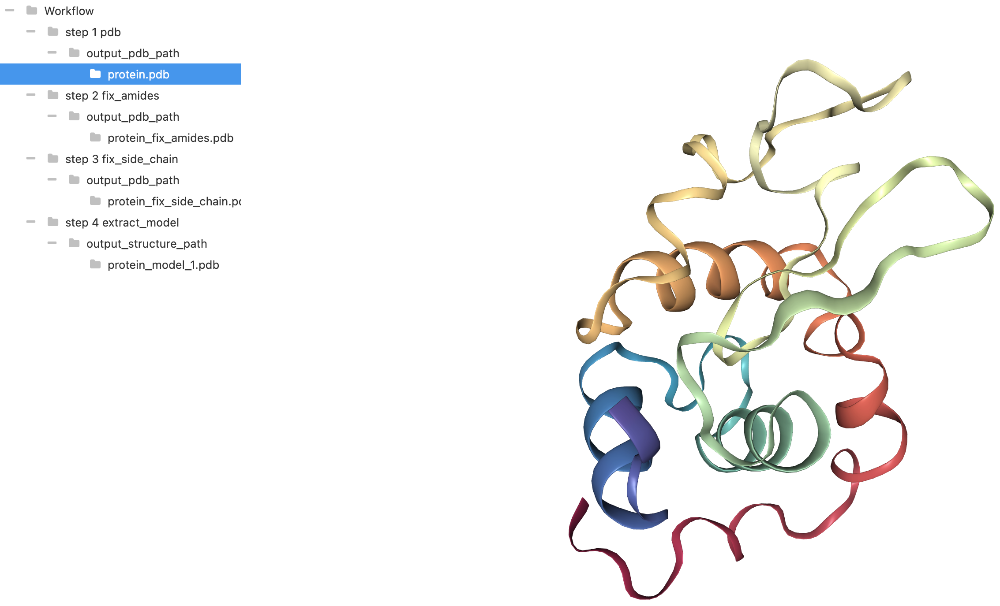

## Multi-step workflows

Our first multi step workflow will consist of downloading a protein from an online database. Unfortunately, experiments are typically unable to resolve all of the atoms and/or residues, so it is necessary to 'fix' the initial data.

On the right is a visual representation of the workflow as a computational graph. The nodes are the steps, and the edges are the input and output files. This graph representation is automatically generated every time you compile a workflow. It is very useful for visually debugging issues with workflows, and so it is a very good idea to ***`always look at the graph representation`*** before running a workflow.

<table>
<tr>
<td>
docs/tutorials/multistep1.yml

```yaml
steps:
- pdb:
    in:
      config:
        pdb_code: 1aki
      output_pdb_path: '&protein.pdb'
- fix_amides:
    in:
      input_pdb_path: '*protein.pdb'
      output_pdb_path: '&protein_fix_amides.pdb'
- fix_side_chain:
    in:
      input_pdb_path: '*protein_fix_amides.pdb'
      output_pdb_path: '&protein_fix_side_chain.pdb'
- extract_model:
    in:
      config:
        models: [1]
      input_structure_path: '*protein_fix_side_chain.pdb'
      output_structure_path: '&protein_model_1.pdb'
```

</td>
<td>
docs/tutorials/multistep1.yml.gv.png



</td>
</tr>
</table>

### Explicit Edges

The first thing you might notice is that all of the filenames are prefixed with `&` and then `*` (and they are in quotes). This is the syntax for explicitly creating an edge between an output and a later input. Note that `&` must come first and can only be defined once, but then you can use `*` multiple times in any later step.

Note that if you just use regular filenames, they are treated as inputs which are external to the workflow, and thus are assumed to already exist on your filesystem. For example, if we remove the `&` and `*` around `protein_fix_amides.pdb`, we will get the following error message:

```yaml
steps:
- pdb:
    in:
      config:
        pdb_code: 1aki
      output_pdb_path: '&protein.pdb'
- fix_amides:
    in:
      input_pdb_path: '*protein.pdb'
      output_pdb_path: protein_fix_amides.pdb
- fix_side_chain:
    in:
      input_pdb_path: protein_fix_amides.pdb
      output_pdb_path: '&protein_fix_side_chain.pdb'
- extract_model:
    in:
      config:
        models: [1]
      input_structure_path: '*protein_fix_side_chain.pdb'
      output_structure_path: '&protein_model_1.pdb'
```

```
Error! /Users/jakefennick/workflow_inference_compiler/docs/tutorials/protein_fix_amides.pdb does not exist!
(Did you forget to use an explicit edge?)
See https://workflow-inference-compiler.readthedocs.io/en/latest/userguide.html#explicit-edges
```

### Visualizing the results

This particular workflow creates files which represent 3D coordinates, so we can view them in the Jupyter notebook `src/vis/viewer.ipynb`. Make sure you are using the `vis` conda environment as mentioned in the installation guide.



### Edge Inference

Creating explicit edges can be a bit tedious and verbose, but in many cases the correct edges can be determined automatically. In this case, all of the steps take the previous pdb file as input and produce an output pdb file, so this is rather trivial. However, for more complex workflows edge inference can drastically simplify the yml files. Note that explicit edges are drawn in blue, and inferred edges are drawn in black/white.

For technical reasons edge inference is not perfect, so ***`users should always check that edge inference actually produces the intended graph`***. For details on the algorithm, see the [user guide](../userguide.md/#edge-inference-algorithm).

<table>
<tr>
<td>
docs/tutorials/multistep2.yml

```yaml
steps:
- pdb:
    in:
      config:
        pdb_code: 1aki
- fix_amides:
- fix_side_chain:
- extract_model:
    in:
      config:
        models: [1]
      output_structure_path: '&protein_model_1.pdb'
```

</td>
<td>
docs/tutorials/multistep2.yml.gv.png


</td>
</tr>
</table>

Next, we will see how we can refactor some steps into a separate workflow.