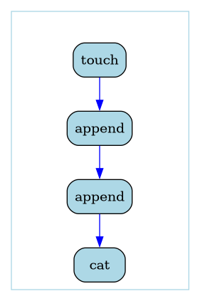
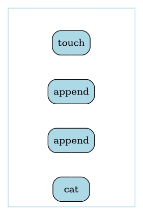

# Multi-step workflows

Our first multi step workflow will consist of creating an empty file with the `touch` command, appending the strings "Hello" and "World!", and then `cat`'ing the file.

On the right is a visual representation of the workflow as a computational graph. The nodes are the steps, and the edges are the input and output files. This graph representation is automatically generated every time you compile a workflow (with `--graphviz`). It is very useful for visually debugging issues with workflows, and so it is a very good idea to ***`always look at the graph representation`*** before running a workflow.

<table>
<tr>
<td>
docs/tutorials/multistep1.wic

```yaml
steps:
- touch:
    in:
      filename: !ii empty.txt
    out:
    - file: !& file_touch
- append:
    in:
      str: !ii Hello
      file: !* file_touch
    out:
    - file: !& file_append_1
- append:
    in:
      str: !ii World!
      file: !* file_append_1
    out:
    - file: !& file_append_2
- cat:
    in:
      file: !* file_append_2
```

</td>
<td>
docs/tutorials/multistep1.wic.gv.png



</td>
</tr>
</table>

## Explicit Edges

The first thing you might notice is the `!&` and `!*` notation. This is the syntax for explicitly creating an edge between an output and a later input. Note that `!&` must come first and can only be defined once, but then you can use `!*` multiple times in any later step.

## Edge Inference

Creating explicit edges can be a bit tedious and verbose, but in many cases the correct edges can be determined automatically. In this case, all of the steps take the previous file as input and produce an output file, so this is rather trivial. However, for more complex workflows edge inference can drastically simplify the wic files. Note that explicit edges are drawn in blue, and inferred edges are drawn in black/white.

For technical reasons edge inference is not perfect, so ***`users should always check that edge inference actually produces the intended graph`***. For details on the algorithm, see the [user guide](../userguide.md/#edge-inference-algorithm).

<table>
<tr>
<td>
docs/tutorials/multistep2.wic

```yaml
steps:
- touch:
    in:
      filename: !ii empty.txt
- append:
    in:
      str: !ii Hello
- append:
    in:
      str: !ii World!
- cat:
```

</td>
<td>
docs/tutorials/multistep2.wic.gv.png



</td>
</tr>
</table>

Next, we will see how we can refactor some steps into a separate workflow.